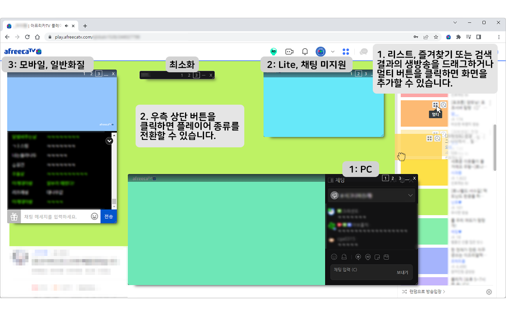
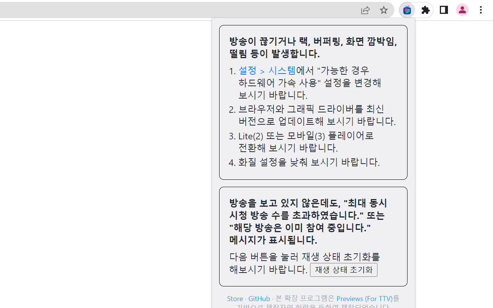

#  MultiFreeca

[Chrome Web Store (Chromium, Edge, Whale 호환)](https://chromewebstore.google.com/detail/mnnenipmhhamjalekeiiilpeaaddiiio) | [Firefox Add-ons](https://addons.mozilla.org/addon/multifreeca/)

여러 아프리카TV 방송을 함께 볼 수 있습니다.
최대 6개(PC 3개, 모바일 3개)의 아프리카TV 방송을 한 화면에서 동시에 함께 시청할 수 있습니다.

스크린 모드, 전체화면에서 사용할 수 있으며, 메인 플레이어는 PIP 모드를 통해 크기와 위치를 조절할 수 있습니다.

## 사용 방법

1. 리스트, 즐겨찾기 또는 검색결과의 생방송을 드래그하거나 멀티 버튼을 클릭하면 화면을 추가할 수 있습니다.
2. 우측 상단 버튼을 클릭하면 플레이어 종류를 전환할 수 있습니다.
   1. PC
   2. 채팅 미지원
   3. 모바일: 일반화질

## FAQ

### 방송이 끊기거나 랙, 버퍼링, 화면 깜박임, 떨림 등이 발생합니다.

1. 설정 > 시스템에서 "가능한 경우 하드웨어 가속 사용" 설정을 변경해 보시기 바랍니다.
2. 브라우저와 그래픽 드라이버를 최신 버전으로 업데이트해 보시기 바랍니다.
3. Lite(2) 또는 모바일(3) 플레이어로 전환해 보시기 바랍니다.
4. 화질 설정을 낮춰 보시기 바랍니다.

### 방송을 보고 있지 않은데도, "최대 동시 시청 방송 수를 초과하였습니다." 또는 "해당 방송은 이미 참여 중입니다." 메시지가 표시됩니다.

A. 확장 프로그램 아이콘을 누르고, 팝업에서 "재생 상태 초기화" 버튼을 눌러 재생 상태 초기화를 해보시기 바랍니다.

## Notes

본 확장 프로그램은 [Previews (For TTV)](https://previews-app.com/)를 기반으로 제작자의 허락을 득하여 제작되었습니다.

본 확장 프로그램은 아프리카TV와 관련이 없으며, 상표와 이미지는 각각 해당 소유자의 자산입니다. 본 확장 프로그램을 사용하여 발생하는 결과에 대한 모든 책임은 사용자에게 있습니다.
